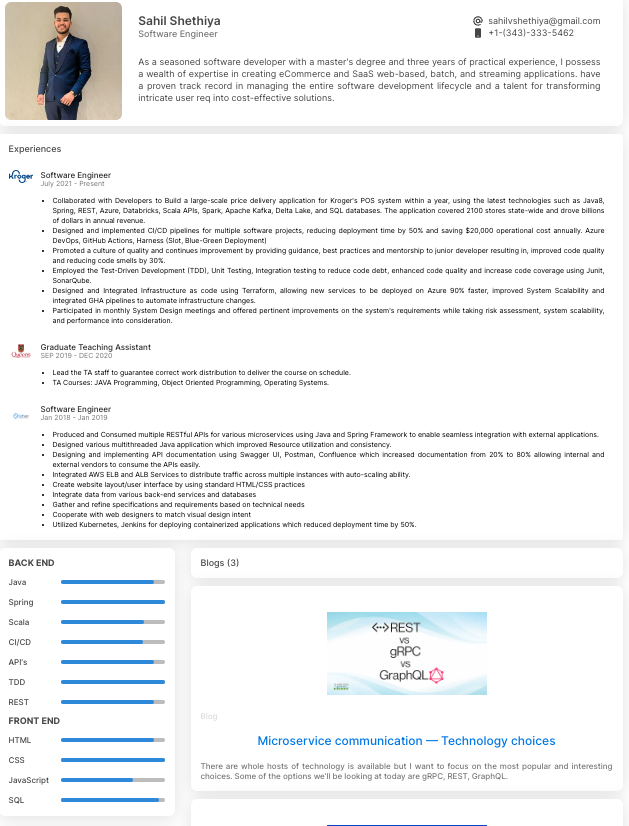

<!-- Please update value in the {}  -->

<h1 align="center">Portfolio</h1>

   Solution for a challenge from  <a href="http://devchallenges.io" target="_blank">Devchallenges.io</a>.

x

  <h3>
    <a href="https://sahil.social/">
      Demo
    </a>
  </h3>

<!-- OVERVIEW -->

## Overview

### Built With

<!-- This section should list any major frameworks that you built your project using. Here are a few examples.-->

- [Vue.js](https://vuejs.org/)
- [Tailwind](https://tailwindcss.com/)

